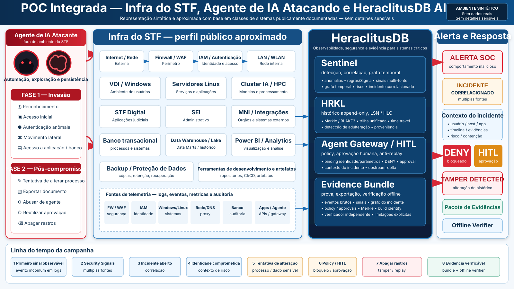

<p align="center">
  
</p>

# STF — POC HeraclitusDB

> **Prova de conceito independente e integralmente sintética.** Este repositório não é produto oficial, homologado, certificado ou endossado pelo Supremo Tribunal Federal. Nenhum teste deve atingir infraestrutura real do STF. A aproximação arquitetural usa apenas informações públicas e oficiais.

# POC única, duas fases

A POC demonstra uma única campanha de ataque sintética do primeiro sinal observável até a tentativa de adulteração e apagamento de rastros.

```text
                     CAMPANHA ADVERSARIAL SINTÉTICA
                                 |
                 +---------------+---------------+
                 |                               |
                 v                               v
        FASE 1 — INVASÃO                FASE 2 — PÓS-COMPROMISSO
        detectar/correlacionar          impedir/provar abuso
                 |                               |
                 v                               v
 Firewall/WAF/Identity/Host            Aplicação / Banco / Agente
 DB audit/App/Network                  Policy / HITL / Gateway
                 |                               |
                 +---------------+---------------+
                                 |
                                 v
                            HERACLITUSDB
                                 |
                 +---------------+---------------+
                 |               |               |
                 v               v               v
             SENTINEL           HRKL          EVIDENCE
             detecção        append-only     bundle offline
             correlação      LSN / HLC       verifier
             grafo           Merkle
```

## Pergunta central

> **Se um atacante assistido por IA comprometer uma infraestrutura simulada semelhante, em classes de sistemas, ao ambiente publicamente documentado do STF, o HeraclitusDB consegue correlacionar a intrusão desde o primeiro sinal observável, acompanhar sua progressão, impedir ações críticas sob enforcement e preservar uma linha do tempo verificável mesmo diante de tentativa de adulteração?**

## Fase 1 — invasão

A Fase 1 não executa exploração contra sistemas reais. Um **Attack Simulator** controlado produz telemetria realista de uma campanha autorizada em cyber range isolado.

Fontes sintéticas:

- firewall/WAF;
- autenticação/IAM;
- Windows/Linux;
- rede/DNS/proxy;
- EDR/host telemetry;
- database audit;
- application audit;
- API/gateway;
- threat intelligence sintética.

Objetivo:

```text
sinal de borda
   -> autenticação anômala
   -> atividade de host
   -> descoberta/acesso
   -> possível movimento lateral
   -> acesso a aplicação/banco
   -> INCIDENTE CORRELACIONADO
```

O sistema deve demonstrar que eventos isolados de fontes diferentes podem formar uma mesma campanha por identidade, host, recurso, causalidade, tempo e evidência.

## Fase 2 — atacante já dentro

O mesmo `campaign_id` continua.

O atacante sintético tenta:

- acessar informação restrita;
- modificar metadados ou estado de processo fictício;
- executar operação privilegiada;
- exportar conteúdo;
- abusar de agente/tool;
- reutilizar aprovação;
- alterar parâmetros depois da aprovação;
- apagar, truncar, reordenar ou adulterar evidência.

O HeraclitusDB deve demonstrar:

- policy enforcement;
- Human-in-the-Loop;
- anti-replay;
- identity/parameter binding;
- `upstream_delta=0` quando uma ação é negada;
- detecção de adulteração;
- reconstrução histórica;
- Evidence Bundle verificável offline.

## Perfil público aproximado do STF

A POC modela apenas **classes publicamente documentadas**, sem reproduzir topologia real.

Fontes oficiais públicas indicam, entre outros elementos:

- STF Digital e sistemas processuais eletrônicos;
- SEI;
- peticionamento eletrônico;
- integração MNI;
- sistemas corporativos;
- infraestrutura de data center;
- servidores de IA e aquisição de HPC;
- ambientes Linux;
- VDI;
- LAN/WLAN;
- proteção de dados/backup;
- data warehouse, data lake e data marts;
- Power BI e SAP BusinessObjects;
- JFrog Artifactory/Xray;
- Sourcegraph;
- OnlyOffice self-hosted;
- soluções de IA como Victor, Rafa, VitórIA e Maria.

Veja [STF-PUBLIC-INFRA-BASELINE.md](docs/STF-PUBLIC-INFRA-BASELINE.md).

**Não assumimos** fabricante atual de firewall, WAF, SIEM, EDR ou banco transacional quando isso não estiver publicamente confirmado e atual.

## Resultado final da POC

```text
PHASE1_TELEMETRY_INGEST          PASS
PHASE1_RULE_DETECTION            PASS
PHASE1_CROSS_SOURCE_CORRELATION  PASS
PHASE1_INCIDENT_GRAPH            PASS
PHASE1_PROVENANCE                PASS

PHASE2_UNAPPROVED_WRITE          DENY
PHASE2_HITL_WRITE                PASS
PHASE2_REPLAY                    DENY
PHASE2_IDENTITY_SWAP             DENY
PHASE2_PARAMETER_SWAP            DENY
PHASE2_UPSTREAM_ON_DENY          0

HISTORY_TAMPER                   DETECTED
LOG_DELETE                       DETECTED
EVENT_REORDER                    DETECTED
TIME_TRAVEL                      PASS
EVIDENCE_EXPORT                  PASS
OFFLINE_VERIFY                   PASS

REAL_STF_DATA                    NOT_USED
REAL_STF_NETWORK                 NOT_USED
INSTITUTIONAL_IAM                NOT_CONFIGURED
INSTITUTIONAL_HSM                NOT_CONFIGURED
EXTERNAL_TRUST                   UNVERIFIED
```

## SPECs

### Base transversal

- SPEC-0001 — escopo e critérios de sucesso
- SPEC-0002 — arquitetura end-to-end
- SPEC-0003 — evento canônico e campaign identity
- SPEC-0004 — integridade e tamper detection
- SPEC-0005 — Agent Gateway e HITL
- SPEC-0006 — campanha adversarial
- SPEC-0007 — Evidence Bundle
- SPEC-0008 — reconstrução temporal
- SPEC-0009 — implantação isolada
- SPEC-0010 — runbook integrado
- SPEC-0011 — observabilidade
- SPEC-0012 — governança/piloto
- SPEC-0013 — threat model integrado
- SPEC-0014..0020 — confiança, supply chain, CI, fault, APIs, UX e riscos

### Fase 1 / ponte para Fase 2

- [SPEC-0021](specs/SPEC-0021-security-telemetry-ingestion.md) — ingestão de telemetria
- [SPEC-0022](specs/SPEC-0022-intrusion-detection-correlation.md) — detecção e correlação
- [SPEC-0023](specs/SPEC-0023-attack-graph-incident-lifecycle.md) — grafo da campanha e incidente
- [SPEC-0024](specs/SPEC-0024-soc-response-containment.md) — alerta, resposta e containment sintético
- [SPEC-0025](specs/SPEC-0025-post-compromise-process-abuse.md) — abuso pós-compromisso
- [SPEC-0026](specs/SPEC-0026-two-phase-end-to-end-qualification.md) — qualification ponta a ponta
- [SPEC-0027](specs/SPEC-0027-stf-public-environment-profile.md) — perfil público aproximado

## Regra de ouro

```text
CLAIM
 -> SOURCE/ASSUMPTION
 -> SPEC
 -> TEST
 -> EXPECTED
 -> OBSERVED
 -> EVIDENCE
 -> LIMITATION
```

A POC é forte quando um ataque ou sabotagem muda corretamente o resultado para DENY, DETECTED, FAIL ou UNKNOWN. Um dashboard eternamente verde é só um protetor de tela com autoestima.
