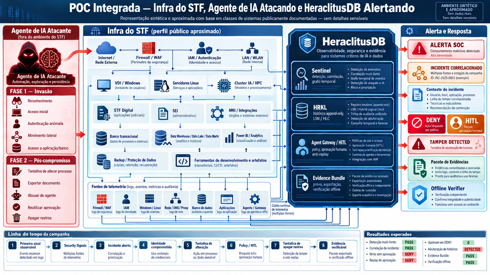
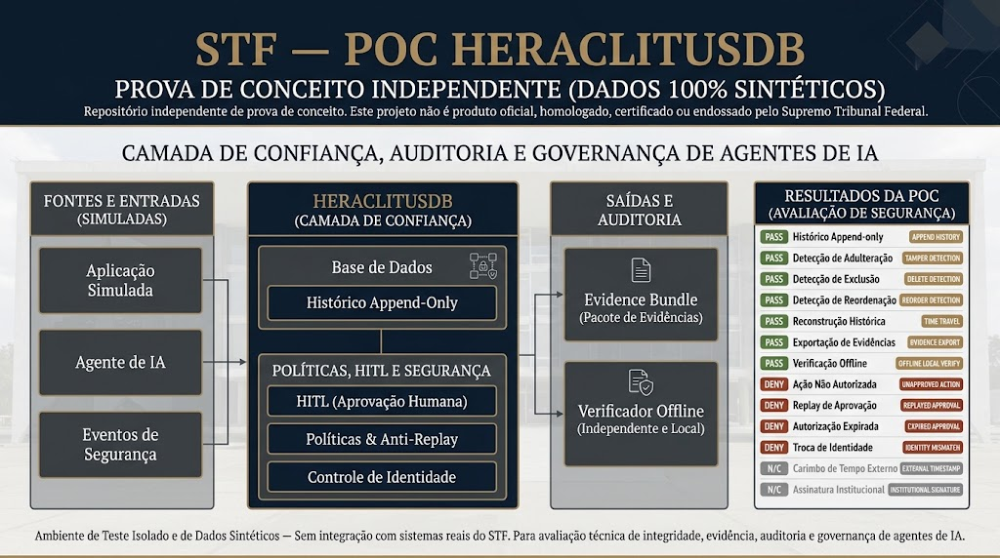
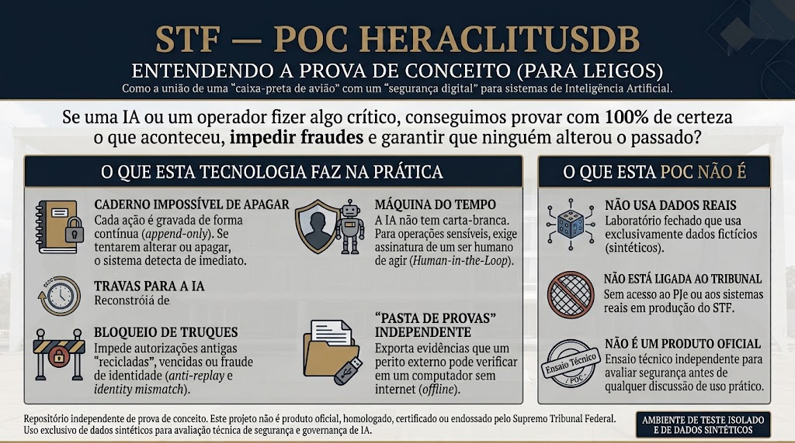
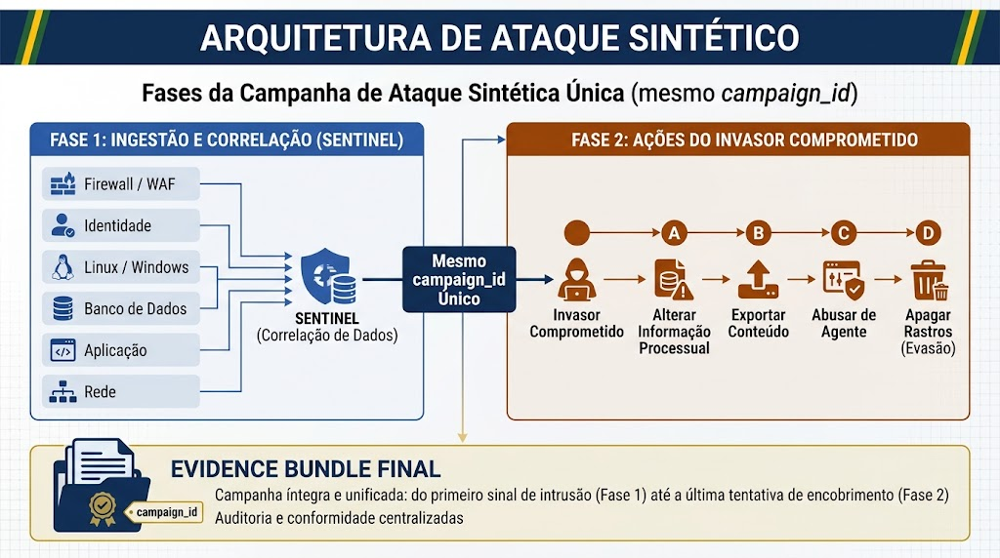
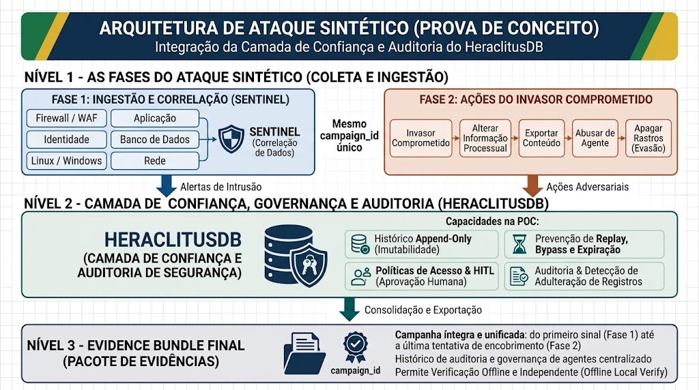
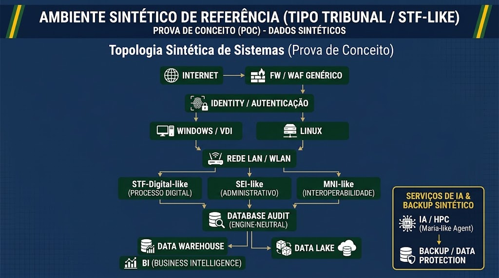
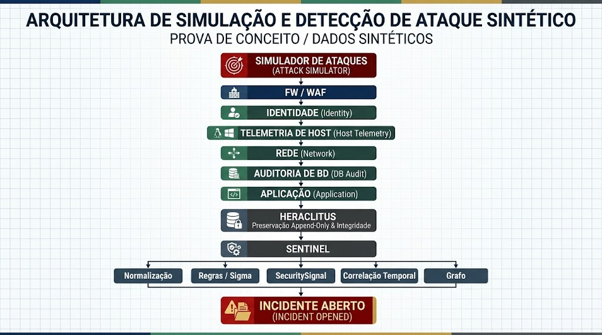
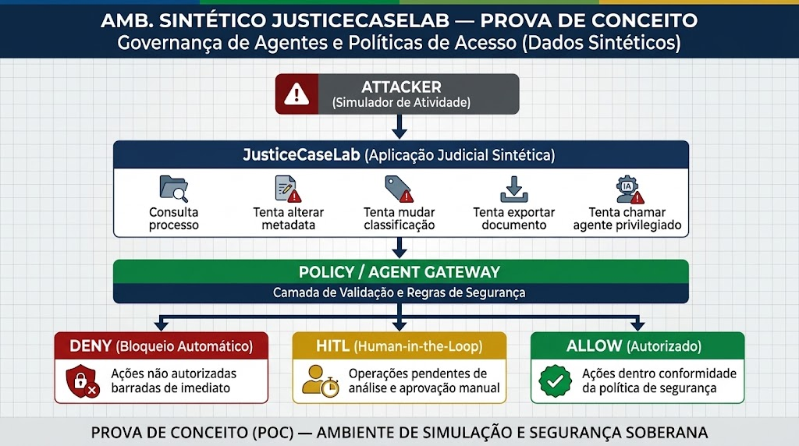

# Guia Visual da Arquitetura — POC STF / HeraclitusDB

Este documento reúne os diagramas e infográficos arquiteturais que ilustram o funcionamento, os controles de segurança e os fluxos da Prova de Conceito.

---

## 1. Visão Geral da Arquitetura Integrada
> Representação sintética e aproximada com base em classes de sistemas publicamente documentadas do STF, simulando a campanha adversarial, a ingestão multi-fonte pelo Sentinel, a preservação append-only no HRKL, as políticas do Agent Gateway e a geração do Evidence Bundle.

  

---

## 2. Camada de Confiança, Auditoria e Governança de Agentes de IA
> Visão em blocos funcionais: Fontes simuladas → HeraclitusDB (Camada de Confiança) → Saídas e Auditoria → Resultados da Qualificação técnica da POC.

  

---

## 3. Entendendo a Prova de Conceito (Visão Executiva / Para Leigos)
> Como a união de uma "caixa-preta de avião" com um "segurança digital" protege sistemas de Inteligência Artificial contra ações não autorizadas e adulterações retroativas.

  

---

## 4. Fases da Campanha Adversarial Sintética Única
> O mesmo `campaign_id` une a Fase 1 (Detecção e Correlação multi-fonte) e a Fase 2 (Ações do atacante pós-comprometimento e tentativa de evasão), culminando no Evidence Bundle.

  

---

## 5. Níveis da Arquitetura de Ataque Sintético
> Nível 1: Ingestão e Correlação (Sentinel) e Ações Adversariais  
> Nível 2: Camada de Confiança, Governança e Auditoria (HeraclitusDB)  
> Nível 3: Evidence Bundle final com verificação offline e independente.

  

---

## 6. Topologia Sintética de Sistemas (Ambiente Tipo Tribunal / STF-like)
> Mapeamento de classes de sistemas: Perímetro (FW/WAF), Identidade (IAM), Estações/Servidores (Windows/Linux), LAN/WLAN, Aplicações (STF-Digital-like, SEI-like, MNI-like), Banco com auditoria, Data Warehouse/Lake e Cluster de IA/HPC.

  

---

## 7. Simulação e Detecção de Intrusão em Pipeline
> Do gerador de telemetria até a normalização, regras determinísticas, emissão de `SecuritySignal`, correlação temporal em grafo e abertura do incidente.

  

---

## 8. Governança de Agentes e Políticas de Acesso (JusticeCaseLab)
> Ações sensíveis em processos fictícios (consulta, alteração de metadados, mudança de classificação, exportação e chamada de ferramenta) filtradas por `DENY`, `HITL` ou `ALLOW`.

  

